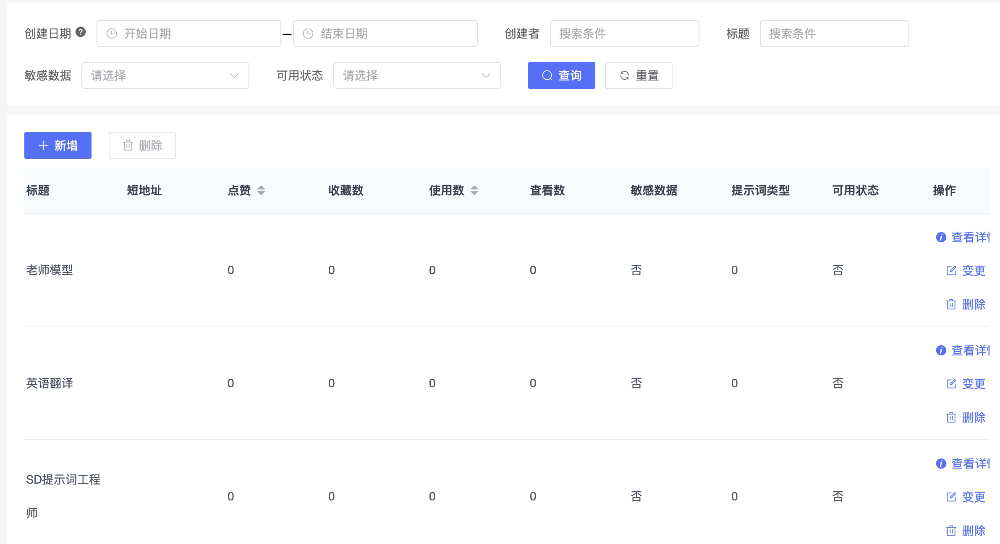

---
layout:
  title:
    visible: true
  description:
    visible: false
  tableOfContents:
    visible: true
  outline:
    visible: true
  pagination:
    visible: true
---

# 4.1 设计模式与架构模式



铺垫了这么久，今天开始我们就要进入正式的开发环节来。 话不多说，从最核心的提示词开始，我们先解决后端的接口。

始终要记得，我们前面已经提到的先要处理“**第一条数据是从哪里来的**”这个问题。

我们现在先设定一个小目标：**编写添加一条提示词的功能**。

动手前，先来两个概念：设计模式和架构模式。

### 4.1.1 设计模式与MVC

> 在 1994 年，四人帮（全拼 Gang of Four）合著出版了一本名为 Design Patterns - Elements of Reusable Object-Oriented Software（中文译名：**设计模式 - 可复用的面向对象软件元素**） 的书，该书首次提到了软件开发中设计模式的概念。两个核心点：
>
> * 对接口编程而不是对实现编程。
> * 优先使用对象组合而不是继承。

而设计模式的经典代表MVC (Model-View-Controller)模式，无论在什么语言里都是一个常见的设计模式，用于组织代码以实现**可维护**和**可扩展**的架构。

1. **Model（模型）**:
   * 模型负责管理程序的数据和业务逻辑。
   * 在Go中，模型通常通过结构体和接口来实现，并可能与数据库或其他数据源进行交互。
   * 模型层提供了数据的存取、验证和转换等功能，它是与业务逻辑直接相关的部分。

```go
type User struct {
    ID        string
    Name      string
    Email     string
}

func (u *User) Save() error {
    // 保存用户数据到数据库
    // ...
    return nil
}
```

2. **View（视图）**:
   * 视图负责用户界面的展示，它用于生成用户界面并呈现数据。
   * 在基于Go的Web开发中，视图通常通过模板引擎来实现，如`html/template`或`text/template`。

```go
// views/user.gohtml
<html>
  <body>
    <h1>User: {{.Name}}</h1>
    <p>Email: {{.Email}}</p>
  </body>
</html>
```

3. **Controller（控制器）**:
   * 控制器接收用户的输入，并调用模型和视图来完成用户的请求。
   * 在Go中，控制器通常通过HTTP处理函数或者路由处理函数来实现。控制器负责解析用户的请求，调用模型来处理数据，并通过视图来生成用户界面。

```go
func UserController(w http.ResponseWriter, r *http.Request) {
    user := User{
        ID: "1",
        Name: "John Doe",
        Email: "john.doe@example.com",
    }
    tpl, _ := template.New("user.gohtml").ParseFiles("views/user.gohtml")
    tpl.Execute(w, user)
}
```

以上片是在Go中MVC模式的简单地实现。使用Go的一些流行的Web框架，如Gin或Echo，可以进一步简化和优化MVC架构的实现。

### 4.1.2 架构模式与前后端分离

> 架构模式（Architectural Pattern）是软件架构中在给定环境下，针对常遇到的问题的、通用且可重用的解决方案。类似于前文所提到的**设计模式**但覆盖范围更广。

前后端分离的架构模式属于**分层架构**和**模块化设计**，分层架构属于软件架构设计领域的架构模式。它是一种垂直的系统层次划分方式,通常包括表示层、业务层、数据访问层等。使得软件系统在垂直方向上保持结构清晰、组件职责明确。

而模块化设计属于软件设计领域的代码组织方式。它是一种水平的系统划分方式,将系统划分为功能明确、相对独立的模块。有利于代码的复用和维护。

这两者在软件设计中通常会同时采用,既关注系统的垂直层次划分,也注重水平方向的模块化拆分,从不同粒度引导软件设计。它们相辅相成,共同推动代码的复用、逻辑清晰和维护性。

我们来看一下基于`gin-vue-admin`的后端代码目录结构：

```
├── api // API接口
│   └── v1 // v1版本API
├── config // 配置
├── core // 核心组件
├── docs // 文档
├── global // 全局对象
├── initialize // 初始化
│   └── internal // 内部初始化函数
├── middleware // 中间件
├── model // 模型
│   ├── request // 请求参数结构体
│   └── response // 响应结构体 
├── packfile // 打包文件
├── resource // 资源
│   ├── excel // Excel文件
│   ├── page // 页面文件
│   └── template // 模板
├── router // 路由
├── service // 业务逻辑
├── source // 源数据函数
└── utils // 工具函数
    ├── timer // 定时器封装
    └── upload // 上传封装
```

（详细描述见附录4。）

在前端代码作为视图层(见前文MVC模式)分离后，后端代码又可以分为4层：

* 路由层（Router）: 负责路由的定义和请求的分发。
* 控制器层（API）: 负责处理具体的请求，通常会调用服务层的逻辑。
* 服务层（Service）: 负责具体的业务逻辑处理，通常会调用模型层来进行数据处理。
* 模型层（Model）: 负责数据的存储和检索，与数据库交互。

在这样的架构中，所有和数据库交互的操作全部在模型层中完成，这样在上层只需要调用接口，告诉模型我需要怎样的数据，以及筛选条件，不需要关心数据是存在MySQL里，或者是Redis中，抑或者是已经被迁移到了MongoDB。

我们现在就先来为提示词建立一个数据表和对应的模型：

```go
// 提示词 结构体  Prompts
type Prompts struct {
	global.GVA_MODEL
	UserId       *int   `json:"UserId" form:"UserId" gorm:"column:userid;comment:;default:0"`                   //创建者 默认为0
	Title        string `json:"Title" form:"Title" gorm:"column:title;comment:;size:100;"`                      //标题
	Uri          string `json:"Uri" form:"Uri" gorm:"column:uri;comment:;size:30;"`                             //短地址
	Description  string `json:"Description" form:"Description" gorm:"column:description;comment:;type:text;"`   //提示词说明
	ThumbnailURL string `json:"ThumbnailURL" form:"ThumbnailURL" gorm:"column:thumbnai_url;comment:;size:150;"` //封面地址
	Upvotes      *int   `json:"Upvotes" form:"Upvotes" gorm:"column:upvotes;comment:;"`                         //点赞
	Saves        *int   `json:"Saves" form:"Saves" gorm:"column:saves;comment:;"`                               //收藏数
	Uses         *int   `json:"Uses" form:"Uses" gorm:"column:uses;comment:;"`                                  //使用数
	Views        *int   `json:"Views" form:"Views" gorm:"column:views;comment:;"`                               //查看数
	Nsfw         *bool  `json:"Nsfw" form:"Nsfw" gorm:"column:is_nsfw;comment:;"`                               //敏感数据
	Type         *int   `json:"Type" form:"Type" gorm:"column:type;comment:;size:1;"`                           //提示词类型
	Available    *bool  `json:"Available" form:"Available" gorm:"column:available;comment:;default:true"`       //可用状态 默认为true
	Body         string `json:"Body" form:"Body" gorm:"column:body;comment:;type:text;"`                        //提示词正文

}
```

如果项目很复杂，还可以独立出DAO层，它可以：

* **提高代码复用性**：DAO 层可以对数据库操作进行封装，提高代码复用性。我个人很讨厌业务中的各种复制粘贴，这种项目的后期维护成本非常高，经常会出现莫名其妙的问题。
* **解耦业务逻辑和数据库操作**：DAO 层负责与数据库交互，将数据库操作与业务逻辑分离，可以使业务逻辑更简洁、易于维护。
* **提高代码可测试性**：DAO 层的代码可以单独进行测试，提高代码可测试性。

你如果有过更换数据源，或者要为某些查询逻辑进行修改的经历，那你就知道同一套逻辑在不同地方复制粘贴时要修改时的痛苦。而封装这些接口，只需要管理传入参数和返回参数，中间的整个过程都不需要业务层去考虑，非常适合团队协作，避免出现屎山代码。

当然，因为我们项目的复杂度相对较低，所以可以直接在上层封装Service层。

```go
// CreatePrompts 创建提示词记录
// Author [piexlmax](https://github.com/piexlmax)
func (promptsService *PromptsService) CreatePrompts(prompt *onion.Prompts) (err error) {
	err = global.GVA_DB.Create(prompt).Error

	return err
}
```

这一层是可以封装较为复杂的业务逻辑的，它跟数据库无关，而跟业务有关，关心的是某个具体的业务的实现。而在其上的控制器(Controller)相对而言就更不关系数据村在哪里，而是关心数据从哪里来，

```go
package onion
type PromptsApi struct {
}

func (promptsApi *PromptsApi) CreatePrompts(c *gin.Context) {
	// 准备prompts容器并且绑定数据
	var prompts onion.Prompts
	err = c.ShouldBindJSON(&prompts)
	// 如果绑定出现错误
	if err != nil {
		response.FailWithMessage(err.Error(), c)
		return
	}
	// 对数据进行校验
	verify := utils.Rules{
		"Title": {utils.NotEmpty()},
	}
	if err := utils.Verify(prompts, verify); err != nil {
		response.FailWithMessage(err.Error(), c)
		return
	}
	// 调用Service创建提示词
	if err := promptsService.CreatePrompts(&prompts); err != nil {
		fmt.Println("开始创建提示")
		global.GVA_LOG.Error(global.Translate("general.creationFail"), zap.Error(err))
		response.FailWithMessage(global.Translate("general.creationFailErr"), c)
	} else {
		response.OkWithMessage(global.Translate("general.createSuccss"), c)
	}
}
```

这样最简单的实现就完成了。 我们只需要加入路由，让其能被访问就好。

```go
// InitPromptsRouter 初始化 提示词 路由信息
func (s *PromptsRouter) InitPromptsRouter(Router *gin.RouterGroup) {
	promptsRouter := Router.Group("prompts").Use(middleware.OperationRecord())
	promptsRouterWithoutRecord := Router.Group("prompts")
	var promptsApi = v1.ApiGroupApp.OnionApiGroup.PromptsApi
	{
		promptsRouter.POST("createPrompts", promptsApi.CreatePrompts)             // 新建提示词
		promptsRouter.DELETE("deletePrompts", promptsApi.DeletePrompts)           // 删除提示词
		promptsRouter.DELETE("deletePromptsByIds", promptsApi.DeletePromptsByIds) // 批量删除提示词
		promptsRouter.PUT("updatePrompts", promptsApi.UpdatePrompts)              // 更新提示词
	}
	{
		promptsRouterWithoutRecord.GET("findPrompts", promptsApi.FindPrompts)       // 根据ID获取提示词
		promptsRouterWithoutRecord.GET("getPromptsList", promptsApi.GetPromptsList) // 获取提示词列表
	}
}

```

当然，如果想要简化Http请求，只用`GET`和`POST`其实也足够了，删除和修改不使用`DELETE`和`PUT`，而使用POST请求也是没有问题的。

