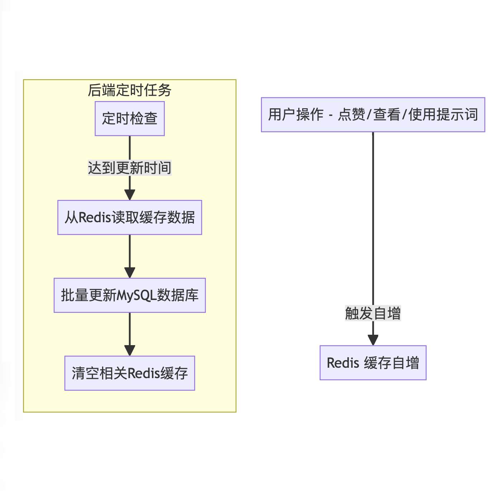

# 3.3 Redis作为缓存的应用

观察我们的提示词数据表。&#x20;

（[完整的字典请翻阅附录](../../appendix/appendix-3-data-dict.md)）

| 字段名          | 说明                           |
| ------------ | ---------------------------- |
| prompt\_id   | 提示词的唯一标识符，用于在数据库中唯一标识一个提示词   |
| ...          | ...                          |
| updated\_at  | 提示词的最后更新时间，用于追踪提示词的修改历史      |
| usage\_count | 提示词被使用的次数（计数器），用于追踪提示词的受欢迎程度 |
| likes        | 提示词获得的喜欢或赞的数量，用于追踪提示词的受欢迎程度  |
| ...          | ...                          |

这里的usage\_count和likes在用户点赞和进入聊天窗口后需要增加，同时updated\_at修改为当时的时间戳。

在FlowGPT中，甚至还有`views`字段，这意味着每次被查看，都需要更新数据库 `+1`。 高频的写入操作会给数据库服务器带来很大的压力，尤其是在高并发的环境下。

以这样的频率去做Update操作，要么服务器爆炸，要么拿钱堆出来。 显然两种方式都不是最优解。

那么我们有什么办法解决MySQL的高频写入问题？

先看数据的重要性，从业务的角度来说，功能合理而且相对重要，不能弱化功能，但是数据发生丢失，不会造成致命的错误。那既然这样，我们能不能x分钟更新一次，这样即使发生数据丢失也只有x分钟的点赞和阅读量数据。

显然这个方案的代价是最低的，虽然FlowGPT的这几项数据在显示上不是实时更新的，但是实际情况即使是实时更新也不是很大的问题。

为了解决这个问题，可以考虑利用Redis的高性能特点，将高频的计数操作暂存在Redis中，然后定时地批量更新到MySQL数据库。我们来看操作流程：

#### 1. **数据结构设计**：

* 在Redis中为每个提示词创建一个Hash数据结构，用于暂存`usage_count`，`likes`和`views`的增量数据。例如，可以用`prompt:<prompt_id>`作为键，`usage_count`、`likes`和`views`作为字段。

#### 2. **数据增量更新**：

* 当用户点赞、查看或使用提示词时，直接在Redis中对相应的计数器进行增量更新。具体操作可以使用Redis的`HINCRBY`命令。

#### 3. **定时任务设计**：

* 设计一个定时任务，例如每5分钟运行一次，从Redis中读取所有的增量数据，并批量更新到MySQL数据库。
* 更新MySQL数据库后，清空Redis中的相关数据，为下一轮的计数做准备。

#### 4. **异常处理**：

* 考虑到可能存在的系统异常，例如服务器突然宕机等，应确保Redis的数据持久化设置，以防数据丢失。可以选择RDB或AOF持久化方式。

#### 5. **数据同步**：

* 在定时任务运行的时候，需要确保新的计数操作不会丢失。可以考虑使用事务或锁来保证数据的一致性。

#### 6. **缓存击穿**：

* 当缓存击穿的时候，直接从数据库中读取，然后存入Redis中即可，并没有额外的MySQL操作成本。

这样的设计能显著降低MySQL的写入压力，同时利用Redis的高性能特点，确保系统的响应速度。虽然有一定的数据延迟，但从业务角度看，这种延迟是完全可以接受的。同时，通过合理的异常处理和缓存击穿的预处理，也能保证系统的稳定性和数据的安全性。

